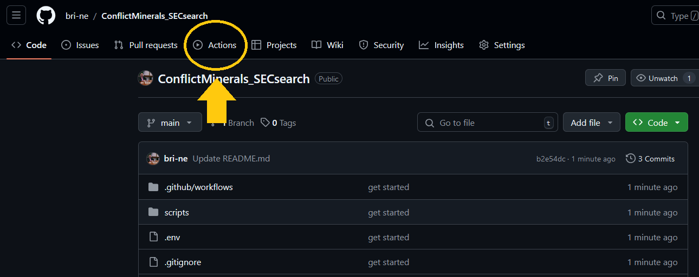
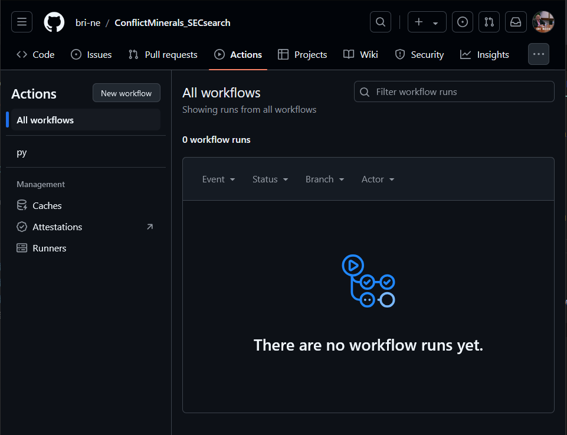
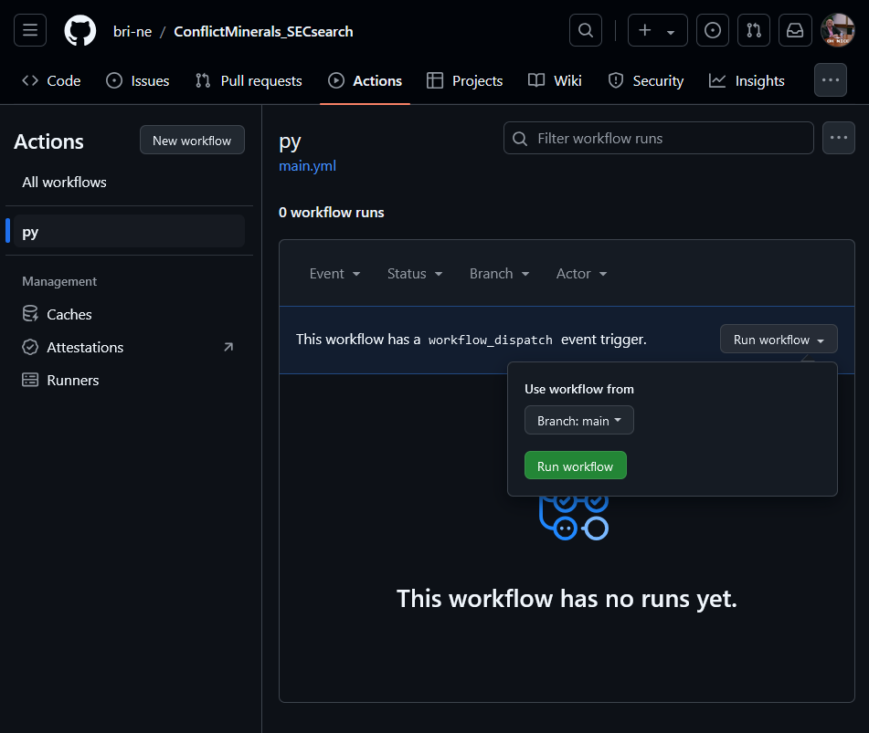
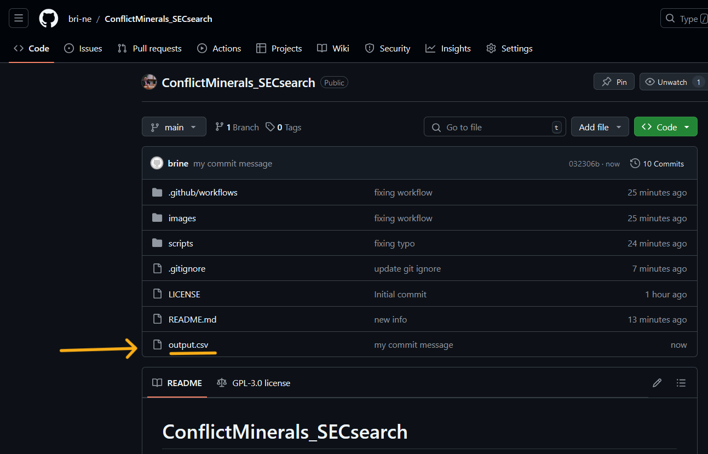
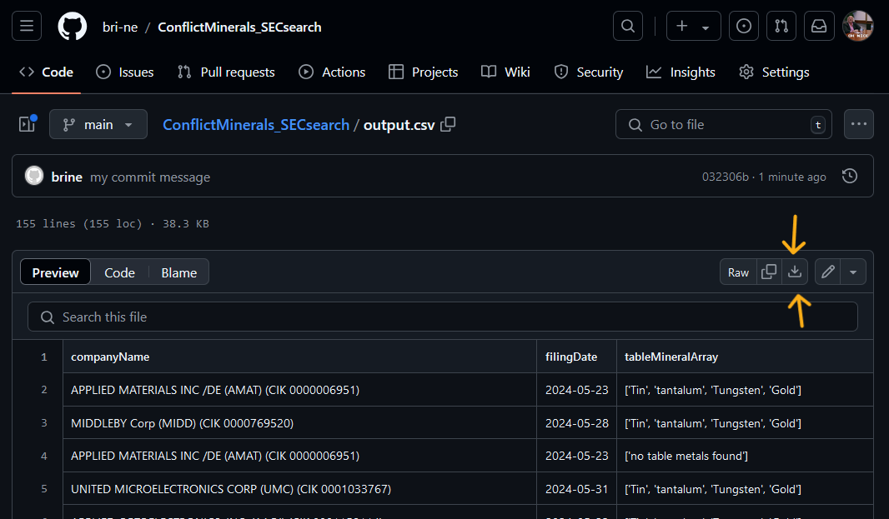
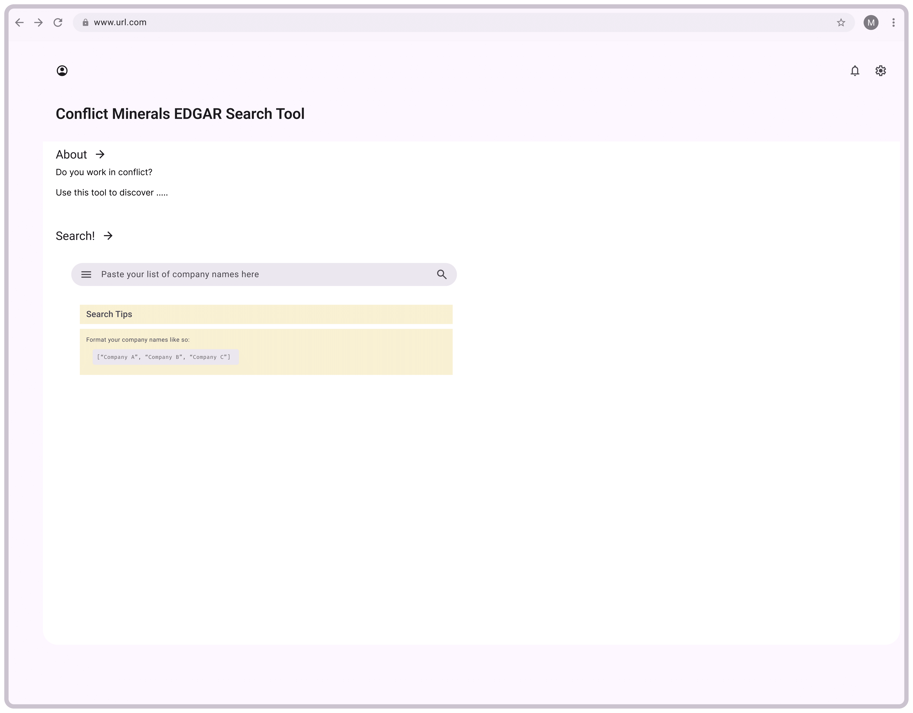

# ConflictMinerals_SECsearch
Use this tool to investigate corporations' use of conflict minerals by searching SEC Specialized Disclosures 

## Quick Start

> [!IMPORTANT]
> Before you start, you will need to obtain your own SEC API key. You can do that here: [https://sec-api.io/signup/free](https://sec-api.io/signup/free)

* Fork the repo
* Add your SEC API Key as a repo secret. Be sure to name it "KEY"
  * [Github's Guide for this](https://docs.github.com/en/actions/security-for-github-actions/security-guides/using-secrets-in-github-actions#creating-secrets-for-a-repository)
* Update the file `company_names.py` to include the companies you want to search for
  * **be sure to format as an array of strings, e.g `["Company A", "Company B", "Company C"]`**
* Run as Github Action
  * On the menu bar click "Actions" 
    
  * Click on the workflow name `py`
    
  * Then, click "Run workflow" button (look to the right in the workflow table for the button)
    
* Navigate back to the main repo to find the output file (`output.csv`)
  
* Click on the output file, and then download
  

## Helpful links 

* This repo relies on the Securities and Exchange Commission's [EDGAR Database Full Text Search API](https://sec-api.io/docs/full-text-search-api)

## Forthcoming

In the near future, there will be an option to use this workflow straight from a web interface. 

Benefits of this option:
* This option will make this tool accesible to a wider population
* Through this option a user would not need their own api key

Here's what this could like: 

